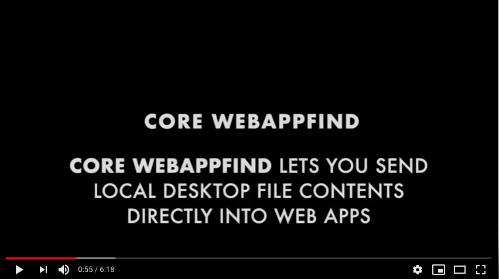

# webappfind
<!-- TODO: Adapt the filetypes.json comments below after implementation -->

## WebAppFind Core

A [WebExtensions](https://developer.mozilla.org/en-US/Add-ons/WebExtensions)
add-on ([AMO](https://addons.mozilla.org/en-US/firefox/addon/webappfind/))
to allow opening of files from the desktop (by double-click using
default file associations or "Open with...") into web applications.

**While this extension has now been minimally reimplemented from version
2.0.0, it is now Mac-only instead of Windows-only (what I happen to be
developing on now), and some of the functionality (especially using
a `filetypes.json` file) has not yet been restored. There have also been
breaking changes in the API, and the add-on is Firefox-only at present.**

You must install the executable at <http://brett-zamir.name/webappfind/node8-macos-x64-installer>
(or build from source; uses `pkg`).

## Videos

- [Short overview of WebAppFind capabilities](http://brett-zamir.name/webappfind/WebAppFind%20Quick%20Overview.mp4) ([Youtube](https://www.youtube.com/watch?v=2ysSAPKhDwQ) or click screenshot below)
- [Intro and Rationale](http://brett-zamir.name/webappfind/WebAppFind-Intro-and-Rationale.mp4) ([Youtube](https://www.youtube.com/watch?v=nflwCasjnG0))
- [Extended usage tutorial](http://brett-zamir.name/webappfind/WebAppFind%20Usage.mp4) ([Youtube](https://www.youtube.com/watch?v=wuP25cguR6o))

## The WebAppFind Bundle

Due to the inconvenience of creating installers for and bundling Node in
each extension, and because the add-ons included within this WebAppFind bundle
are still experimental, we are bundling four add-ons together.

- WebAppFind (core) - [Developer Guide](Developer-Guide.md) / [User Guide](./docs/User-Guide.md)
- [ExecutableBuilder](./executable-builder/README.md)
- [AtYourCommand](./atyourcommand/README.md) -
- [AsYouWish](./README-AsYouWish.md)

See the respective READMEs for more details.

**Note that the AtYourCommand features have not been well-tested, and as they
call the command line, use at your own risk!**

**AsYouWish too, is also potentially dangerous if you grant permission to
sites asking it. AsYouWish may be separated out in the future, but for
convenience it is currently being bundled.**

**ExecutableBuilder (and WebAppFind core) is more well-tested, but as it
works with system files (e.g., modifying LaunchServices to associate default
files), if there are problems, some rebuilding of some system files could
be required.**

For more granular choice as to features and exposure to riskier features, I
currently am hoping to separate these add-ons out in the future.

We may also be able to take advantage of
[native-ext](https://github.com/NiklasGollenstede/native-ext) for
factoring out the Node code from each of these add-ons in the future
so there is little added weight for each add-on.

## Introduction to WebAppFind Core

Are you a fan of web apps, but want the freedom to place your data files
where you like on your desktop and thus be able to work offline and **own**
your data rather than keeping it in the Cloud?

Do you want the freedom to be able to just double-click (or right-click)
a file on your desktop so that it opens into a web app, saving you the
trouble of having to copy the file path, move from your desktop to the
web app, and paste the path in a file finder?

Do you want to avoid the wrist strain of dragging files into
your web app in order to get a web app to read your files, especially
when any modifications made to your files cannot even be saved back directly
to the same place on your hard drive without renavigating to the path?

WebAppFind addresses these concerns by allowing you to double-click (or
use "Open with..." right-click) on executable files on your
desktop, sending the file path details to the [native messaging](https://developer.mozilla.org/en-US/Add-ons/WebExtensions/Native_messaging)
component of the add-on (via command line arguments) which are then
delivered into the main browser add-on.<!--
Todo: Reenable if supporting `filetypes.json`
which, if no site is hard-coded
in the request, checks for an *optional* `filetypes.json` file within the
same directory as the right-clicked file to determine more precise
handling (the file extension will be used to determine the type otherwise).
Based on what is chosen/found and in the addon's preferences,
-->
Based on the site that is baked into the executable,
a handler web site will be sought in the browser to open the file of the
designated type (whether a generic or custom type) as well as allow--if
the "edit" mode was chosen (as opposed to the readonly "view" mode)--saves
to be made back to the file.

WebAppFind allow you to make your data files accessible to web-accessible
programs and to give your users peace of mind to not be locked
into your application alone, and, if your web app allows this, the
ability to work completely offline while keeping data files where you
wish on your desktop.

It also allows your users to open files of your own custom types into
your program immediately and from their desktop<!-- , and intelligently,
using whatever file extension you prefer, even if the file extension
is a generic one such as "json" or "js" while your own data file
follows a particular format or schema-->.

Unlike an approach that would allow websites the ability to request
local file access, *webappfind* minimizes security and privacy risks
by only allowing files designated in the above manner of selection by you from
your desktop to be available to the relevant web application; sites cannot
gain such access without your running the process that grants permission.

## Some use case scenarios

1. See [webappfind-demos-samples](https://github.com/brettz9/webappfind-demos-samples).
    This repository provides a number of basic open source web apps which may
    help get you started in editing local files within web apps or may serve
    as a basis for your own apps. (The repo also includes some sample files for
    testing and developer utilities.)
1. Work on Git on your desktop while being able to open HTML files for
    WYSIWYG editing in a (CKEditor) web app which you can easily modify, e.g.,
    to add buttons for inserting code snippets. Use CodeMirror
    for syntax highlighting of your JavaScript and CSS, etc. (Demos are
    available in the previous repo which do all of this.)

## User guide

See [User-Guide](./docs/User-Guide). Indicates usage of the executables on your
OS desktop, using your OS' desktop UI to associate your own executables (including
those built through the bundled ExecutableBuilder), and, for those interested,
how to work WebAppFind from the command line. Building the executables is
handled by the [Executable Builder component](executable-builder/README.md).

## Developers

### App Developer Guide

See [Developer-Guide](./docs/Developer-Guide.md).<!-- Includes information on the
`filestypes.json` file format.-->

### Third-party customization

- [Registered file types](./docs/Registered-file-types.md)
- [Registered arguments](./docs/Registered-arguments.md)
    - [Registered custom modes](./docs/Registered-custom-modes.md)

### Design rationale

See [DESIGN](./docs/DESIGN.md) and [Tools-and-Comparisons](./docs/Tools-and-Comparisons).

### Contributing to WebAppFind

See [CONTRIBUTING](./docs/CONTRIBUTING.md).

## To-dos

See [TO-DOS](./docs/TO-DOS.md).
